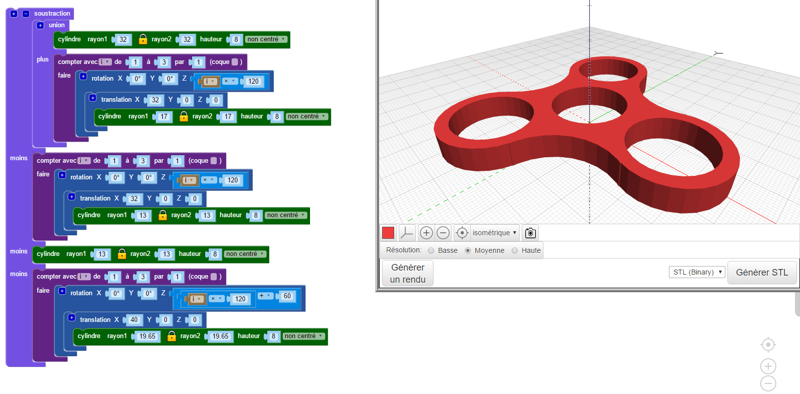
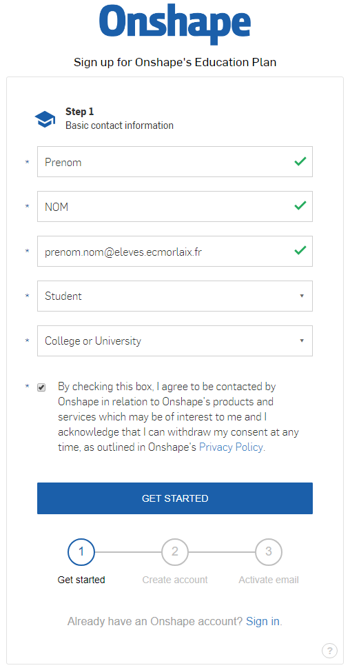

# Modélisation, simulation et prototypage par impression 3D

La conception d’un mécanisme commence par la réalisation d’un modèle numérique 3D pour permettre sa simulation et son prototypage.

Pour cela, plusieurs solutions s'offrent à nous... 

## BlocksCAD :

<figure markdown>
  { width="40%" .center }
</figure>

<a href="https://www.blockscad3d.com/" target="_blank">BlocksCAD</a> permet de générer des modèles 3D de pièces avec la programmation graphique par blocs :

<figure markdown>
  { width="60%" .center }
</figure>

??? example "Sprint de découverte à faire vous même : ..."

    ### Défin n°1 : Modéliser un pion avec BlocksCAD
    
    <figure markdown>
      { width="50%" .center }
      <figcaption>Pion orange</figcaption>
    </figure>

    A l'adresse <a href="https://www.blockscad3d.com/editor/" target="_blank">https://www.blockscad3d.com/editor/</a>. Dans la barre de menu, sous l'icone en forme de "planète", choisir la langue : Français. Puis cliquer sur le bouton "Créer un compte".
    
    Créer un compte en utilisant un pseudo "correct", le mot de passe de votre choix, et votre adresse mail : prenom.nom@eleves.ecmorlaix.fr
    
    <figure markdown>
      { width="70%" .center }
    </figure>
    La fenêtre graphique de l'application BlocksCAD s'organise ainsi :
    
    <figure markdown>
      { width="80%" .center }
      <figcaption>
        
Source : <a href="https://drive.google.com/file/d/0BylI2DCyFdKFSHRMUzZHV0RKYjQ/view" target="_blank">Cyril VIGNET</a>

      </figcaption>
    </figure>
           
    Voici une proposition d'étapes à suivre pour la prise en main de BlocksCAD et la modélisation d'un pion du casse-tête.      
    A chaque étape, reproduire l'algorithme en glissant les blocs concernés depuis le menu vertical des fonctions jusque dans la fenêtre centrale du programme puis, régler le "Smooth" sur "High" et cliquer sur le bouton "Générer un rendu".

    === "Etape 1 :"
        <figure markdown>
          <figcaption markdown>==Un premier cylindre (rayon = 7 mm, hauteur = 17 mm) centré ;==</figcaption>
          { width="90%" .center }          
        </figure>
    === "Etape 2 :"
        <figure markdown>
          <figcaption markdown>==Un second cylindre (rayon = 4 mm, hauteur = 8 mm) reposant sur le précédent ;==</figcaption>
          { width="90%" .center }
        </figure>
    === "Etape 3 :"
        <figure markdown>
          <figcaption markdown>==Un tore (rayon 1 = 12 mm, rayon 2 = 7 mm) ;==</figcaption>
          { width="90%" .center }
        </figure>
    === "Etape 4 :"
        <figure markdown>
          <figcaption markdown>==Opérations d'assemblage et mise en couleur ;==</figcaption>
          { width="90%" .center }
        </figure>
    === "Etape 5 :"
        ==Il s'agit maintenant de renommer le projet, par exemple "monPion-prenom_nom", afin de l'enregistrer en cliquant sur le bouton "Sauver" ;==
    === "Etape 6 :"   
        ==Enfin, il suffit de régler le format de fichier sur "STL binary" puis de cliquer sur le bouton "Générer STL" afin de télécharger un fichier du modèle exploitable pour l'imprimante 3D.==

    ***
    ### Défin n°2 : Modéliser un support imprimable
    
    A l'aide de BlocksCAD, imaginer un modèle pour le support des pions.  
    Afin de recevoir les six pions du jeu tout en laissant un emplacement libre, cette pièce doit comporter sept trous cylindriques de diamètre 8mm et de profondeur 9mm, distants chacun d'un pas de 17mm.
    
    <figure markdown>
      { width="70%" .center }
      <figcaption>Exemple de support possible</figcaption>
    </figure>
    
    Il sera judicieux d'utiliser une boucle de répétition.  
    Les autres formes du support sont libres dans la mesure où le modèle généré reste imprimable avec la printrBot.

    *** 
    ### Défin n°3 : A vous de jouer...
    Avec l'aide du [guide pour BlocksCAD](../pdf/GuideBlocksCAD.pdf){target=_blank} réalisé par Cyril VIGNET, imaginer et prototyper une modélisation3D pour votre projet...
        
    ***
    ### Prolongement : autres ressources...
    
    - <a href="http://blogpeda.ac-poitiers.fr/lp2i-si/2016/03/20/blockscad-un-logiciel-de-cao-pour-concevoir-rapidement-des-pieces-a-imprimer-en-3d/" target="_blank">Article de Daniel PERS professeur de SI au LP2I</a>
    
    ***

## TinkerCAD :
<figure markdown>
  { width="40%" .center }
</figure>

    Pour utiliser <a href="https://www.tinkercad.com/" target="_blank">TinkerCAD</a> il faut s'incrire en rejoignant une classe avec le code fournit.

    A l'instar de BlocksCAD, <a href="https://www.tinkercad.com/learn/codeblocks" target="_blank">TinkerCAD-codeblocks</a> permet de générer des modèles 3D des pièces avec la programmation graphique par blocs.  	  				
    Mais <a href="https://www.tinkercad.com/learn/designs" target="_blank">TinkerCAD-designs</a>  permet également de modéliser à partir d'une bibliothèque de modèles 3D.  
    Par ailleurs <a href="https://www.tinkercad.com/learn/circuits" target="_blank">TinkerCAD-circuits</a> a absorbé l'ancien 123Dcircuit et permet de modéliser, programmer et simuler des circuits électroniques à base d'Arduino et de BBC micro:bit.

<figure>    
    <iframe width="560" height="315" src="https://www.youtube-nocookie.com/embed/FlsmkPCYIzc" frameborder="0" allow="accelerometer; autoplay; encrypted-media; gyroscope; picture-in-picture" allowfullscreen></iframe>
    <figcaption>Vidéo de démonstration de l'intérêt de TinkerCAD-codeblocks pour la modélisation volumique paramétrée :</figcaption>
</figure>

??? example "Sprint de découverte à faire vous même : ..."

    ### Défin n°1 : Modéliser un pion avec TinkerCAD-codeblocks
  
    <figure markdown>
      { width="50%" .center }
      <figcaption>Pion orange</figcaption>
    </figure>
    
    A l'adresse <a href="https://www.tinkercad.com/learn/codeblocks" target="_blank">https://www.tinkercad.com/learn/codeblocks/</a>, rejoindre la classe avec le code et le pseudo donnés.
    
    A l'adresse <a href="https://www.tinkercad.com/dashboard" target="_blank">https://www.tinkercad.com/dashboard</a>, choisir Codeblocks dans le menu de gauche, puis cliquer sur le bouton "Créer un Codeblock" puis "Nouvelle conception"
        
    <figure markdown>
      { width="50%" .center }
      <figcaption>
        <a href="https://www.tinkercad.com/codeblocks" target="_blank">L'éditeur en ligne de TinkerCAD-codeblocks</a>
        </figcaption>
    </figure>

    Voici une proposition d'étapes à suivre pour la prise en main de TinkerCAD-codeblocks et la modélisation d'un pion du casse-tête.  
    A chaque étape, reproduire l'algorithme en glissant les blocs concernés depuis le menu vertical des fonctions jusque dans la fenêtre centrale du programme puis cliquer sur le bouton <button class="fa fa-play" style="font-size: 15px;"></button>
    === "Etape 1 :"
        <figure markdown>
          <figcaption markdown>==Un premier cylindre (rayon = 7 mm, hauteur = 17 mm) centré ;==</figcaption>
          { width="90%" .center }          
        </figure>
    === "Etape 2 :"
        <figure markdown>
          <figcaption markdown>==Un second cylindre (rayon = 4 mm, hauteur = 8 mm) reposant sur le précédent ;==</figcaption>
          { width="90%" .center }
        </figure>
    === "Etape 3 :"
        <figure markdown>
          <figcaption markdown>==Un tore (rayon = 12 mm, tube = 7 mm) ;==</figcaption>
          { width="90%" .center }
        </figure>
    === "Etape 4 :"
        <figure markdown>
          <figcaption markdown>==Opérations d'assemblage et définition d'un objet ;==</figcaption>
          { width="90%" .center }
        </figure>
    === "Etape 5 :"
        ==Il s'agit maintenant de renommer le projet, par exemple "monPion-prenom_nom", afin de l'enregistrer en cliquant sur le bouton "Exporter" au format "OBJ". On peut également l'exporter au format "Part" pour pouvoir l'importer ensuite dans un projet <a href="https://www.tinkercad.com/learn/designs" target="_blank">TinkerCAD-designs</a> ;==
    === "Etape 6 :"   
        ==Enfin, il suffit de l'exporter au format "STL" afin de télécharger un fichier du modèle exploitable pour l'imprimante 3D.==
    
    
    ***
    ### Défin n°2 : Modéliser un support imprimable
    
    A l'aide de TinkerCAD-codeblocks, imaginer un modèle pour le support des pions.  
    Afin de recevoir les six pions du jeu tout en laissant un emplacement libre, cette pièce doit comporter sept trous cylindriques de diamètre 8mm et de profondeur 9mm, distants chacun d'un pas de 17mm.

    <figure markdown>
      { width="70%" .center }
      <figcaption>Exemple de support possible</figcaption>
    </figure>
    
    Il sera judicieux d'utiliser une boucle de répétition.  
    Les autres formes du support sont libres dans la mesure où le modèle généré reste imprimable avec la printrBot.

    *** 
    ### Défin n°3 : A vous de jouer...
    Imaginer et prototyper une modélisation 3D pour votre projet...
        
    ***
    ### Prolongement : autres ressources...

    TinkerCAD-codeblocks est une application encore récente, des tutoriels devrait apparaitre bientôt. En  attendant voici un échantillon de ce que l'on trouve aujourd'hui à ce sujet sur le web :
    
    - <a href="https://johnumekubo.com/2018/06/26/tinkercad-codeblocks-beta" target="_blank">https://johnumekubo.com/2018/06/26/tinkercad-codeblocks-beta</a>
    - <a href="https://blog.tinkercad.com/2018/06/24/cad-and-code-together-at-last" target="_blank">https://blog.tinkercad.com/2018/06/24/cad-and-code-together-at-last</a>
    - <a href="https://medium.com/@ronm333/an-introduction-to-tinkercad-codeblocks-b896dff5f5f9" target="_blank">https://medium.com/@ronm333/an-introduction-to-tinkercad-codeblocks-b896dff5f5f9</a>
    - <a href="https://hackaday.com/2018/07/06/tinkercad-coding-tricks-to-automate-modeling" target="_blank">https://hackaday.com/2018/07/06/tinkercad-coding-tricks-to-automate-modeling</a>
    ***

## Impression 3D :

<figure markdown>
  { width="40%" .center }
</figure>

??? example "Sprint de découverte à faire vous même : ..."

    ### Mise en situation
    
    <a href="https://fr.wikipedia.org/wiki/Impression_3D" target="_blank">L'impression tridimensionnelle</a> par dépôt de fil plastique en fusion, FDM (Fused Deposition Modeling), comme le fait notre imprimante Simple Metal de marque printrBot, implique la réalisation préalable d'un modèle de la pièce souhaitée avec un logiciel de Conception Assistée par Ordinateur (C.A.O., C.A.D. en anglais).
    
    ### Imprimer un pion avec CURA et la printrBot
    Vérifier que l'imprimante est bien alimentée (bouton on/off à l'arrière de l'alimentation) et connectée en USB au PC.  
    Démarrer alors le logiciel Cura et exécuter les étapes suivantes :
    
    === "Etape 1 :"
        <figure markdown>
        { width=100% .center }
        <figcaption>Cliquer sur l'icone en forme de dossier pour charger un modèle. Parcourir avec l'explorateur jusqu'à sélectionner votre fichier "monPion.stl" qui est sans doute arrivé dans le dossier des téléchargements.</figcaption>
        </figure>
    === "Etape 2 :"
        <figure markdown>
        { width=100% .center }
        <figcaption>Cliquer sur l'icone en forme de boite pour ouvrir la communication série via USB avec l'imprimante. Une fenêtre graphique interface entre l'utilisateur (<a href="https://fr.wikipedia.org/wiki/Interface_graphique" target="_blank">GUI</a>) et l'imprimante s'ouvre alors.</figcaption>
        </figure>
    === "Etape 3 :"
        <figure markdown>
        { width=70% .center }
        <figcaption>Préchauffer la buse et le plateau chauffant respectivement à 210°C et 70°C qui sont des températures adaptées à l'impression du <a href="https://fr.wikipedia.org/wiki/Acide_polylactique" target="_blank">PLA</a>. Observer l'évolution des valeurs de température que renvoient les sondes thermiques (capteurs).</figcaption>
        </figure>
    === "Etape 4 :"
        <figure markdown>
        { width=70% .center }
        <figcaption>Lorsque la température de la buse a atteint les 210°C, cliquer sur le "10" commandant le moteur d'extrusion afin de vérifier la bonne fusion du fil. Retirer l'exédent avec une pince, attention c'est très brûlant...</figcaption>
        </figure>
    === "Etape 5 :"
        <figure markdown>
        { width=70% .center }
        <figcaption>Lorsque toutes les températures sont atteintes, cliquer sur "Imprimer". Au bout de quelques secondes l'imprimante va démarrer automatiquement son cycle.</figcaption>
        </figure>
    
    Lorsque la pièce est terminée, il faut attendre que la température du plateau soit en dessous des 50°C pour décoller le pion.   

## Prolongement :

Aller plus loin grâce au [cours de modélisation 3D de M. Lossendière​​](https://scenari.techno-melh.xyz/modelisation-3d/co/modelisation-3D-MELH.html){target="_blank"} et découvrir plus particulièrement la solution <a href="https://www.onshape.com/" target="_blank">OnShape</a>

??? example "Sprint de découverte à faire vous même : ..."

    <figure markdown>
    { width="60%" .center }
    </figure>

    

        <a href="https://www.onshape.com/" target="_blank">OnShape</a> est une application web qui permet de modéliser en 3D à la manière de SolidWorks mais dans un navigateur. Elle sera donc disponible sur l’ensemble de vos appareils (ordinateur, tablette, smartphone) tant au lycée qu’en dehors. 
        Pour utiliser Onshape, et bénéficier gratuitement d’un compte professionnel pour l’éducation, il faut s'inscrire sur le site <a href="https://www.onshape.com/edu" target="_blank">https://www.onshape.com/edu</a> en cliquant sur le boutton <a href="https://cad.onshape.com/signup2?basicdataid=882c39dc-b273-4a58-a8f4-38562f02001a&extendeddataid=e49c85b6-e574-4303-a137-259ac45146a1&enable_cookie=check&locale=en_US&approveUser=yes&planid=EDU_YEARLY" target="_blank">"Get Started"</a>. 
    Educator et student ont les mêmes possibilités qu’un compte PRO. Pour un compte Education, le logo EDU apparaîtra sur tous les documents.

    <figure markdown>
    <figcaption>Renseigner alors tous les champs du formulaire en deux étapes.</figcaption>
    { width="60%" .center }
    { width="60%" .center }
    <figcaption>Dans une troisième étape, il faut valider l'inscription depuis le mail reçu et définir un mot de passe...</figcaption>
    </figure>
    

        Une fois le compte activé, on peut gérer les paramètres du compte à partir du menu déroulant en haut à droite, en cliquant sur "My account".
    

    

        On peut alors gérer les préférences à partir du menu listé à gauche. Il est utile notamment de changer les unités par défaut, opter pour une manipulation dans la fenêtre graphique équivalente à SolidWorks…
    

    
Par la suite, pour modéliser avec Onshape il faut se connecter sur le site <a href="https://cad.onshape.com" target="_blank">https://cad.onshape.com</a>

    
Des tutoriels pour Onshape sont disponibles sur le site : <a href="https://learn.onshape.com/" target="_blank">https://learn.onshape.com</a> 

    

        Ressources :
        <ul>
            <li>
                <a href="https://www.youtube.com/channel/UCTvd5lUSLtTH8Qcd7Pl1nQg" target="_blank">Une chaine Youtube</a> ;
            </li>
            <li>
                <a href="https://forum.onshape.com/" target="_blank">Un forum</a>
            </li>
            <li>
                <a href="https://forum.onshape.com/discussion/comment/21462#Comment_21462" target="_blank">Un groupe d'utilisateur francophone​</a>
            </li>
        </ul>
    

