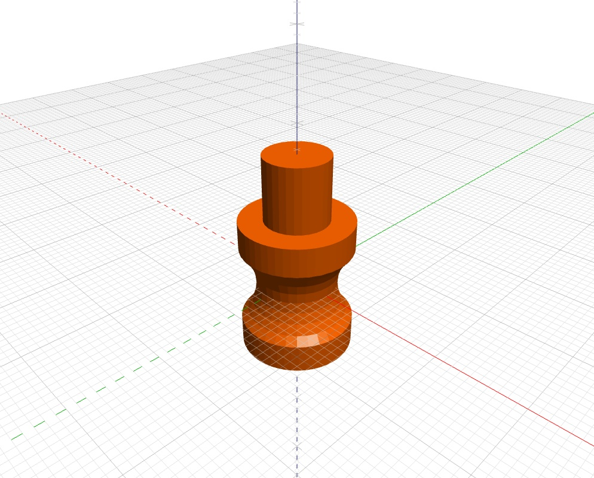
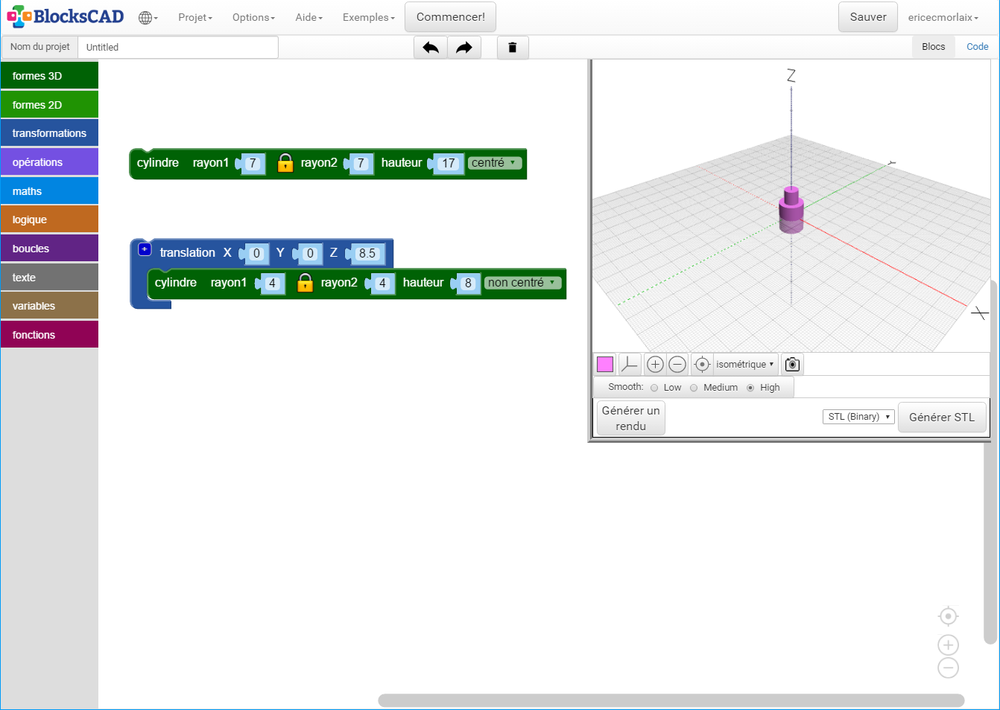
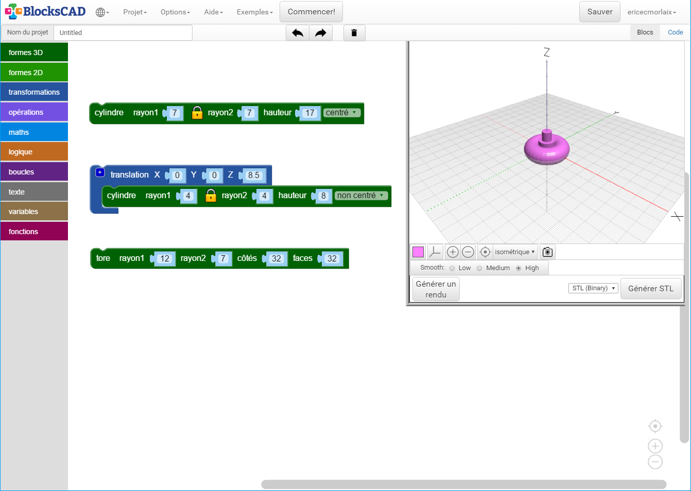
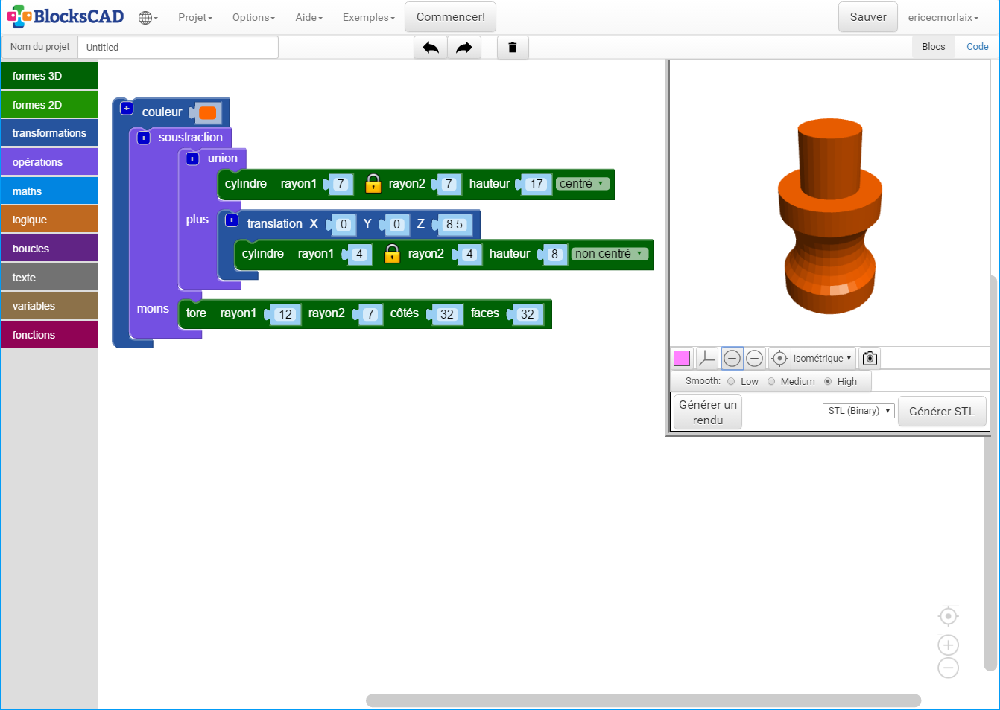

## BlocksCAD :

<figure markdown>
  { width="40%" .center }
</figure>

<a href="https://www.blockscad3d.com/" target="_blank">BlocksCAD</a> permet de générer des modèles 3D de pièces avec la programmation graphique par blocs :

<figure markdown>
  { width="60%" .center }
</figure>

### Activité découverte

???+ abstract "Le casse tête du casse tête :"

    Le problème qu'il nous faut résoudre dans cette activité, tient au fait que nous ne disposons au laboratoire de SI que d'un exemplaire matériel d'un petit jeu de casse-tête :
    
    <figure>
    <figcaption>
      Règle n°1 : Un pion ne peut qu’avancer vers un trou libre, jamais reculer.
    </figcaption>
    <iframe title="Casse Tête Règles" width="560" height="315" src="https://tube-sciences-technologies.apps.education.fr/videos/embed/1946b0b6-de95-4e5c-a909-c51ccf4e370a" frameborder="0" allowfullscreen="" sandbox="allow-same-origin allow-scripts allow-popups"></iframe>
    <figcaption>
      Règle n°2 : Un pion peut sauter par dessus un autre s’ils sont de couleurs opposées
    </figcaption>
    </figure>

    Or un des pions rouges est égaré, nous pourrions alors le reproduire, mais nous sommes nombreux à vouloir y jouer au même moment, c'est donc plusieurs jeux qu'il nous faut faire...
    
???+ question "Défin n°1 : Modéliser un pion avec BlocksCAD"    
        
    <figure markdown>
      { width="50%" .center }
      <figcaption>Pion orange</figcaption>
    </figure>

    A l'adresse <a href="https://www.blockscad3d.com/editor/" target="_blank">https://www.blockscad3d.com/editor/</a>. Dans la barre de menu, sous l'icone en forme de "planète", choisir la langue : Français. Puis cliquer sur le bouton "Créer un compte".
    
    Créer un compte en utilisant un pseudo "correct", le mot de passe de votre choix, et votre adresse mail : prenom.nom@eleves.ecmorlaix.fr
    
    <figure markdown>
      { width="70%" .center }
    </figure>
    La fenêtre graphique de l'application BlocksCAD s'organise ainsi :
    
    <figure markdown>
      { width="80%" .center }
      <figcaption>
        
Source : <a href="https://drive.google.com/file/d/0BylI2DCyFdKFSHRMUzZHV0RKYjQ/view" target="_blank">Cyril VIGNET</a>

      </figcaption>
    </figure>
           
    Voici une proposition d'étapes à suivre pour la prise en main de BlocksCAD et la modélisation d'un pion du casse-tête.      
    A chaque étape, reproduire l'algorithme en glissant les blocs concernés depuis le menu vertical des fonctions jusque dans la fenêtre centrale du programme puis, régler le "Smooth" sur "High" et cliquer sur le bouton "Générer un rendu".

    === "Etape 1 :"
        <figure markdown>
          <figcaption markdown>==Un premier cylindre (rayon = 7 mm, hauteur = 17 mm) centré ;==</figcaption>
          { width="90%" .center }          
        </figure>
    === "Etape 2 :"
        <figure markdown>
          <figcaption markdown>==Un second cylindre (rayon = 4 mm, hauteur = 8 mm) reposant sur le précédent ;==</figcaption>
          { width="90%" .center }
        </figure>
    === "Etape 3 :"
        <figure markdown>
          <figcaption markdown>==Un tore (rayon 1 = 12 mm, rayon 2 = 7 mm) ;==</figcaption>
          { width="90%" .center }
        </figure>
    === "Etape 4 :"
        <figure markdown>
          <figcaption markdown>==Opérations d'assemblage et mise en couleur ;==</figcaption>
          { width="90%" .center }
        </figure>
    === "Etape 5 :"
        ==Il s'agit maintenant de renommer le projet, par exemple "monPion-prenom_nom", afin de l'enregistrer en cliquant sur le bouton "Sauver" ;==
    === "Etape 6 :"   
        ==Enfin, il suffit de régler le format de fichier sur "STL binary" puis de cliquer sur le bouton "Générer STL" afin de télécharger un fichier du modèle exploitable pour l'imprimante 3D.==

    
???+ question "Défin n°2 : Modéliser un support imprimable" 
        
    A l'aide de BlocksCAD, imaginer un modèle pour le support des pions.  
    Afin de recevoir les six pions du jeu tout en laissant un emplacement libre, cette pièce doit comporter sept trous cylindriques de diamètre 8mm et de profondeur 9mm, distants chacun d'un pas de 17mm.
    
    <figure markdown>
      { width="70%" .center }
      <figcaption>Exemple de support possible</figcaption>
    </figure>
    
    Il sera judicieux d'utiliser une boucle de répétition.  
    Les autres formes du support sont libres dans la mesure où le modèle généré reste imprimable avec la printrBot.

    
???+ question "Défin n°3 : A vous de jouer..." 
     
    Avec l'aide du [guide pour BlocksCAD](../pdf/GuideBlocksCAD.pdf){target=_blank} réalisé par Cyril VIGNET, imaginer et prototyper votre version personnalisée du Casse Tête...
        
***
### Prolongement : autres ressources...
    
- <a href="http://blogpeda.ac-poitiers.fr/lp2i-si/2016/03/20/blockscad-un-logiciel-de-cao-pour-concevoir-rapidement-des-pieces-a-imprimer-en-3d/" target="_blank">Article de Daniel PERS professeur de SI au LP2I</a>
    
***